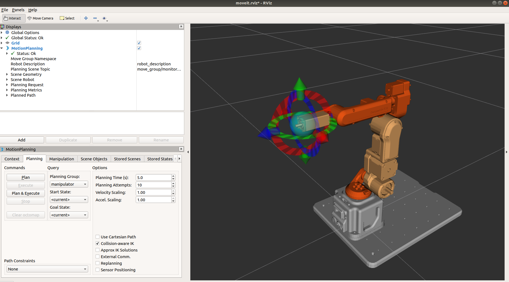
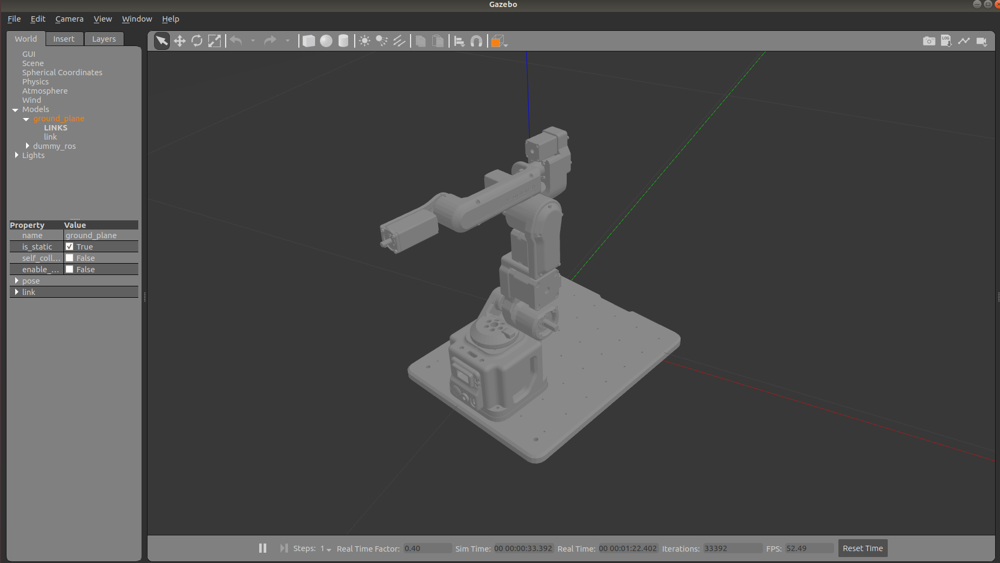

# Dummy-ROS
> Dummy rviz simulate

> Dummy gazebo simulate

如果要生成自己机器人的仿真环境，xxx_moveit_config是根据MoveIt Setup Assistant直接生成的，其中只需要修改ros_controllers.yaml。
dummy_ros_moveit_config/config/ros_controllers.yaml文件和dummy_ros_gazebo_moveit文件夹，可作为其他机器人的模版仿写。
